# Imports


```python
import pandas as pd
import numpy as np
from IPython.display import display_svg
from IPython.display import SVG
```


```python
def show_svg(URL):
    display(SVG(url=URL))
```

# Flowchart


```python
quickOverview = 'file:///C:/Cerebral/pythonWorkspace/CDCIPythonScripts/Analysis/pythonNotebooks/FlowchartSupportFiles/quickOverview.svg'
entireFlowChart = 'file:///C:/Cerebral/pythonWorkspace/CDCIPythonScripts/Analysis/pythonNotebooks/FlowchartSupportFiles/entireFlowChart.svg'
```

## Quick Overview


```python
show_svg(quickOverview)
```





## Detailed Overview


```python
show_svg(entireFlowChart)
```





# ERP Results

## SVM


```python
svmArithmeticMean = pd.io.parsers.read_csv('C:\Cerebral\Database\Fibro\CSVClassificationSummary\SVMArithmeticMean.csv')
svmWoodyFilterMean = pd.io.parsers.read_csv('C:\Cerebral\Database\Fibro\CSVClassificationSummary\SVMWoodyFilterMean.csv')
svmPearsonCorrelationMean = pd.io.parsers.read_csv('C:\Cerebral\Database\Fibro\CSVClassificationSummary\SVMPearsonCorrelationMean.csv')
```


```python
svmArithmeticMean['Type'] = 'ArithmeticMean'
svmWoodyFilterMean['Type'] = 'WoodyFilterMean'
svmPearsonCorrelationMean['Type'] = 'PearsonCorrelationMean'
```

### Combine SVM Results


```python
svmResults = pd.concat([svmArithmeticMean,svmWoodyFilterMean,svmPearsonCorrelationMean],axis=0).reset_index(drop=True)
```

#### Entire SVM Results


```python
colOrder = ['Type','FeatureReductionType','Accuracy','Specificity','Sensitivity','f1']
svmResults[colOrder]
```


<div>
<table border="1" class="dataframe">
  <thead>
    <tr style="text-align: right;">
      <th></th>
      <th>Type</th>
      <th>FeatureReductionType</th>
      <th>Accuracy</th>
      <th>Specificity</th>
      <th>Sensitivity</th>
      <th>f1</th>
    </tr>
  </thead>
  <tbody>
    <tr>
      <th>0</th>
      <td>ArithmeticMean</td>
      <td>Tree Based Feature Importance</td>
      <td>90.000000</td>
      <td>80.000000</td>
      <td>80.0</td>
      <td>80.000000</td>
    </tr>
    <tr>
      <th>1</th>
      <td>ArithmeticMean</td>
      <td>Recursive Feature Elimination Using Logistic R...</td>
      <td>67.500000</td>
      <td>55.000000</td>
      <td>55.0</td>
      <td>53.333333</td>
    </tr>
    <tr>
      <th>2</th>
      <td>ArithmeticMean</td>
      <td>Univariate Feature Reduction</td>
      <td>90.000000</td>
      <td>85.000000</td>
      <td>90.0</td>
      <td>86.666667</td>
    </tr>
    <tr>
      <th>3</th>
      <td>WoodyFilterMean</td>
      <td>Recursive Feature Elimination Using Logistic R...</td>
      <td>95.000000</td>
      <td>95.000000</td>
      <td>100.0</td>
      <td>96.666667</td>
    </tr>
    <tr>
      <th>4</th>
      <td>WoodyFilterMean</td>
      <td>LASSO based feature reduction</td>
      <td>95.000000</td>
      <td>95.000000</td>
      <td>100.0</td>
      <td>96.666667</td>
    </tr>
    <tr>
      <th>5</th>
      <td>WoodyFilterMean</td>
      <td>Univariate Feature Reduction</td>
      <td>90.000000</td>
      <td>85.000000</td>
      <td>90.0</td>
      <td>86.666667</td>
    </tr>
    <tr>
      <th>6</th>
      <td>PearsonCorrelationMean</td>
      <td>Recursive Feature Elimination Using Logistic R...</td>
      <td>75.000000</td>
      <td>75.000000</td>
      <td>90.0</td>
      <td>80.000000</td>
    </tr>
    <tr>
      <th>7</th>
      <td>PearsonCorrelationMean</td>
      <td>LASSO based feature reduction</td>
      <td>76.666667</td>
      <td>80.000000</td>
      <td>95.0</td>
      <td>83.333333</td>
    </tr>
    <tr>
      <th>8</th>
      <td>PearsonCorrelationMean</td>
      <td>Univariate Feature Reduction</td>
      <td>79.166667</td>
      <td>83.333333</td>
      <td>90.0</td>
      <td>84.000000</td>
    </tr>
  </tbody>
</table>
</div>


#### Best SVM Results For Each Type


```python
bestFeat = [2,3,8]
svmResults.iloc[bestFeat][colOrder]
```


<div>
<table border="1" class="dataframe">
  <thead>
    <tr style="text-align: right;">
      <th></th>
      <th>Type</th>
      <th>FeatureReductionType</th>
      <th>Accuracy</th>
      <th>Specificity</th>
      <th>Sensitivity</th>
      <th>f1</th>
    </tr>
  </thead>
  <tbody>
    <tr>
      <th>2</th>
      <td>ArithmeticMean</td>
      <td>Univariate Feature Reduction</td>
      <td>90.000000</td>
      <td>85.000000</td>
      <td>90.0</td>
      <td>86.666667</td>
    </tr>
    <tr>
      <th>3</th>
      <td>WoodyFilterMean</td>
      <td>Recursive Feature Elimination Using Logistic R...</td>
      <td>95.000000</td>
      <td>95.000000</td>
      <td>100.0</td>
      <td>96.666667</td>
    </tr>
    <tr>
      <th>8</th>
      <td>PearsonCorrelationMean</td>
      <td>Univariate Feature Reduction</td>
      <td>79.166667</td>
      <td>83.333333</td>
      <td>90.0</td>
      <td>84.000000</td>
    </tr>
  </tbody>
</table>
</div>


#### Top 5 Best Overall SVM Results


```python
svmResults.sort_values(by=['Accuracy'],ascending =False).head()[colOrder]
```


<div>
<table border="1" class="dataframe">
  <thead>
    <tr style="text-align: right;">
      <th></th>
      <th>Type</th>
      <th>FeatureReductionType</th>
      <th>Accuracy</th>
      <th>Specificity</th>
      <th>Sensitivity</th>
      <th>f1</th>
    </tr>
  </thead>
  <tbody>
    <tr>
      <th>3</th>
      <td>WoodyFilterMean</td>
      <td>Recursive Feature Elimination Using Logistic R...</td>
      <td>95.0</td>
      <td>95.0</td>
      <td>100.0</td>
      <td>96.666667</td>
    </tr>
    <tr>
      <th>4</th>
      <td>WoodyFilterMean</td>
      <td>LASSO based feature reduction</td>
      <td>95.0</td>
      <td>95.0</td>
      <td>100.0</td>
      <td>96.666667</td>
    </tr>
    <tr>
      <th>0</th>
      <td>ArithmeticMean</td>
      <td>Tree Based Feature Importance</td>
      <td>90.0</td>
      <td>80.0</td>
      <td>80.0</td>
      <td>80.000000</td>
    </tr>
    <tr>
      <th>2</th>
      <td>ArithmeticMean</td>
      <td>Univariate Feature Reduction</td>
      <td>90.0</td>
      <td>85.0</td>
      <td>90.0</td>
      <td>86.666667</td>
    </tr>
    <tr>
      <th>5</th>
      <td>WoodyFilterMean</td>
      <td>Univariate Feature Reduction</td>
      <td>90.0</td>
      <td>85.0</td>
      <td>90.0</td>
      <td>86.666667</td>
    </tr>
  </tbody>
</table>
</div>


## Random Forest


```python
randomForestArithmeticMean = pd.io.parsers.read_csv('C:\Cerebral\Database\Fibro\CSVClassificationSummary\RandomTreeArithmeticMean.csv')
randomForestWoodyFilterMean = pd.io.parsers.read_csv('C:\Cerebral\Database\Fibro\CSVClassificationSummary\RandomTreeWoodyFilterMean.csv')
randomForestPearsonCorrelationMean = pd.io.parsers.read_csv('C:\Cerebral\Database\Fibro\CSVClassificationSummary\RandomTreePearsonCorrelationMean.csv')
```


```python
randomForestArithmeticMean['Type'] = 'ArithmeticMean'
randomForestWoodyFilterMean['Type'] = 'WoodyFilterMean'
randomForestPearsonCorrelationMean['Type'] = 'PearsonCorrelationMean'
```

### Combine Random Forest Results


```python
randomForestResults = pd.concat([randomForestArithmeticMean,randomForestWoodyFilterMean,randomForestPearsonCorrelationMean],axis=0).reset_index(drop=True)
```

#### Entire Random Forest Results


```python
colOrder = ['Type','FeatureReductionType','Accuracy','Specificity','Sensitivity','f1']
randomForestResults[colOrder]
```


<div>
<table border="1" class="dataframe">
  <thead>
    <tr style="text-align: right;">
      <th></th>
      <th>Type</th>
      <th>FeatureReductionType</th>
      <th>Accuracy</th>
      <th>Specificity</th>
      <th>Sensitivity</th>
      <th>f1</th>
    </tr>
  </thead>
  <tbody>
    <tr>
      <th>0</th>
      <td>ArithmeticMean</td>
      <td>TreeBased</td>
      <td>64.166667</td>
      <td>56.666667</td>
      <td>80.0</td>
      <td>54.666667</td>
    </tr>
    <tr>
      <th>1</th>
      <td>ArithmeticMean</td>
      <td>RFERandomForest</td>
      <td>71.666667</td>
      <td>20.000000</td>
      <td>25.0</td>
      <td>40.000000</td>
    </tr>
    <tr>
      <th>2</th>
      <td>ArithmeticMean</td>
      <td>RFELDA</td>
      <td>64.166667</td>
      <td>65.000000</td>
      <td>55.0</td>
      <td>56.666667</td>
    </tr>
    <tr>
      <th>3</th>
      <td>ArithmeticMean</td>
      <td>RFELogReg</td>
      <td>64.166667</td>
      <td>56.666667</td>
      <td>60.0</td>
      <td>61.333333</td>
    </tr>
    <tr>
      <th>4</th>
      <td>ArithmeticMean</td>
      <td>Univariate</td>
      <td>85.000000</td>
      <td>86.666667</td>
      <td>75.0</td>
      <td>80.000000</td>
    </tr>
    <tr>
      <th>5</th>
      <td>WoodyFilterMean</td>
      <td>TreeBased</td>
      <td>75.000000</td>
      <td>81.666667</td>
      <td>55.0</td>
      <td>81.333333</td>
    </tr>
    <tr>
      <th>6</th>
      <td>WoodyFilterMean</td>
      <td>RFERandomForest</td>
      <td>67.500000</td>
      <td>50.000000</td>
      <td>55.0</td>
      <td>63.333333</td>
    </tr>
    <tr>
      <th>7</th>
      <td>WoodyFilterMean</td>
      <td>RFELDA</td>
      <td>41.666667</td>
      <td>60.000000</td>
      <td>70.0</td>
      <td>50.000000</td>
    </tr>
    <tr>
      <th>8</th>
      <td>WoodyFilterMean</td>
      <td>RFELogReg</td>
      <td>86.666667</td>
      <td>65.000000</td>
      <td>80.0</td>
      <td>66.666667</td>
    </tr>
    <tr>
      <th>9</th>
      <td>WoodyFilterMean</td>
      <td>LASSO</td>
      <td>95.000000</td>
      <td>65.000000</td>
      <td>80.0</td>
      <td>63.333333</td>
    </tr>
    <tr>
      <th>10</th>
      <td>WoodyFilterMean</td>
      <td>Univariate</td>
      <td>87.500000</td>
      <td>80.000000</td>
      <td>75.0</td>
      <td>62.666667</td>
    </tr>
    <tr>
      <th>11</th>
      <td>PearsonCorrelationMean</td>
      <td>TreeBased</td>
      <td>67.500000</td>
      <td>85.000000</td>
      <td>55.0</td>
      <td>87.333333</td>
    </tr>
    <tr>
      <th>12</th>
      <td>PearsonCorrelationMean</td>
      <td>RFERandomForest</td>
      <td>66.666667</td>
      <td>58.333333</td>
      <td>65.0</td>
      <td>71.333333</td>
    </tr>
    <tr>
      <th>13</th>
      <td>PearsonCorrelationMean</td>
      <td>RFELDA</td>
      <td>61.666667</td>
      <td>35.000000</td>
      <td>65.0</td>
      <td>41.666667</td>
    </tr>
    <tr>
      <th>14</th>
      <td>PearsonCorrelationMean</td>
      <td>Univariate</td>
      <td>79.166667</td>
      <td>86.666667</td>
      <td>75.0</td>
      <td>88.000000</td>
    </tr>
  </tbody>
</table>
</div>


#### Best Random Forest Results For Each Type


```python
bestFeat = [4,9,14]
randomForestResults.iloc[bestFeat][colOrder]
```


<div>
<table border="1" class="dataframe">
  <thead>
    <tr style="text-align: right;">
      <th></th>
      <th>Type</th>
      <th>FeatureReductionType</th>
      <th>Accuracy</th>
      <th>Specificity</th>
      <th>Sensitivity</th>
      <th>f1</th>
    </tr>
  </thead>
  <tbody>
    <tr>
      <th>4</th>
      <td>ArithmeticMean</td>
      <td>Univariate</td>
      <td>85.000000</td>
      <td>86.666667</td>
      <td>75.0</td>
      <td>80.000000</td>
    </tr>
    <tr>
      <th>9</th>
      <td>WoodyFilterMean</td>
      <td>LASSO</td>
      <td>95.000000</td>
      <td>65.000000</td>
      <td>80.0</td>
      <td>63.333333</td>
    </tr>
    <tr>
      <th>14</th>
      <td>PearsonCorrelationMean</td>
      <td>Univariate</td>
      <td>79.166667</td>
      <td>86.666667</td>
      <td>75.0</td>
      <td>88.000000</td>
    </tr>
  </tbody>
</table>
</div>


#### Top 5 Best Overall Random Forest Results


```python
randomForestResults.sort_values(by=['Accuracy'],ascending =False).head()[colOrder]
```


<div>
<table border="1" class="dataframe">
  <thead>
    <tr style="text-align: right;">
      <th></th>
      <th>Type</th>
      <th>FeatureReductionType</th>
      <th>Accuracy</th>
      <th>Specificity</th>
      <th>Sensitivity</th>
      <th>f1</th>
    </tr>
  </thead>
  <tbody>
    <tr>
      <th>9</th>
      <td>WoodyFilterMean</td>
      <td>LASSO</td>
      <td>95.000000</td>
      <td>65.000000</td>
      <td>80.0</td>
      <td>63.333333</td>
    </tr>
    <tr>
      <th>10</th>
      <td>WoodyFilterMean</td>
      <td>Univariate</td>
      <td>87.500000</td>
      <td>80.000000</td>
      <td>75.0</td>
      <td>62.666667</td>
    </tr>
    <tr>
      <th>8</th>
      <td>WoodyFilterMean</td>
      <td>RFELogReg</td>
      <td>86.666667</td>
      <td>65.000000</td>
      <td>80.0</td>
      <td>66.666667</td>
    </tr>
    <tr>
      <th>4</th>
      <td>ArithmeticMean</td>
      <td>Univariate</td>
      <td>85.000000</td>
      <td>86.666667</td>
      <td>75.0</td>
      <td>80.000000</td>
    </tr>
    <tr>
      <th>14</th>
      <td>PearsonCorrelationMean</td>
      <td>Univariate</td>
      <td>79.166667</td>
      <td>86.666667</td>
      <td>75.0</td>
      <td>88.000000</td>
    </tr>
  </tbody>
</table>
</div>


# Single Trial Results

## SVM Single Trial Results


```python
svmSingleTrial = pd.io.parsers.read_csv('C:\Cerebral\Database\Fibro\CSVClassificationSummary\SVMSingleTrial.csv')
svmSingleTrial
```


<div>
<table border="1" class="dataframe">
  <thead>
    <tr style="text-align: right;">
      <th></th>
      <th>FeatureReductionType</th>
      <th>Accuracy</th>
      <th>Specificity</th>
      <th>Sensitivity</th>
      <th>f1</th>
    </tr>
  </thead>
  <tbody>
    <tr>
      <th>0</th>
      <td>LASSO based feature reduction</td>
      <td>88.027675</td>
      <td>90.054134</td>
      <td>88.304924</td>
      <td>88.415065</td>
    </tr>
    <tr>
      <th>1</th>
      <td>Univariate Feature Reduction</td>
      <td>87.863741</td>
      <td>89.977082</td>
      <td>87.992424</td>
      <td>88.101818</td>
    </tr>
    <tr>
      <th>2</th>
      <td>Tree Based Feature Importance</td>
      <td>51.321787</td>
      <td>55.720272</td>
      <td>47.357955</td>
      <td>49.328734</td>
    </tr>
  </tbody>
</table>
</div>


## Random Forest Single Trial Results


```python
randomForestSingleTrial = pd.io.parsers.read_csv('C:\Cerebral\Database\Fibro\CSVClassificationSummary\RandomTreeSingleTrial.csv')
randomForestSingleTrial.sort_values(by=['Accuracy'],ascending =False).head()
```


<div>
<table border="1" class="dataframe">
  <thead>
    <tr style="text-align: right;">
      <th></th>
      <th>FeatureReductionType</th>
      <th>Accuracy</th>
      <th>Specificity</th>
      <th>Sensitivity</th>
      <th>f1</th>
    </tr>
  </thead>
  <tbody>
    <tr>
      <th>4</th>
      <td>Univariate</td>
      <td>67.133968</td>
      <td>67.559752</td>
      <td>65.473485</td>
      <td>60.696256</td>
    </tr>
    <tr>
      <th>0</th>
      <td>TreeBased</td>
      <td>64.484400</td>
      <td>71.690071</td>
      <td>66.117424</td>
      <td>63.998860</td>
    </tr>
    <tr>
      <th>3</th>
      <td>LASSO</td>
      <td>55.420765</td>
      <td>55.622352</td>
      <td>53.816288</td>
      <td>51.221707</td>
    </tr>
    <tr>
      <th>2</th>
      <td>RFELogReg</td>
      <td>50.541248</td>
      <td>51.052350</td>
      <td>38.390152</td>
      <td>47.633425</td>
    </tr>
    <tr>
      <th>1</th>
      <td>RFERandomForest</td>
      <td>46.109025</td>
      <td>50.625649</td>
      <td>46.429924</td>
      <td>46.935638</td>
    </tr>
  </tbody>
</table>
</div>


# Pipeline of Overall Best Results

## ERP (SVM:95% RF:95%)


```python
bestERPPipelineV01 = 'file:///C:/Cerebral/pythonWorkspace/CDCIPythonScripts/Analysis/pythonNotebooks/FlowchartSupportFiles/bestERPPipelineV01.svg'
show_svg(bestERPPipelineV01)
```


## Single Trial (SVM:88% RF:67%)


```python
bestSingleTrialPipelineV01 = 'file:///C:/Cerebral/pythonWorkspace/CDCIPythonScripts/Analysis/pythonNotebooks/FlowchartSupportFiles/bestSingleTrialPipelineV01.svg'
show_svg(bestSingleTrialPipelineV01)
```




