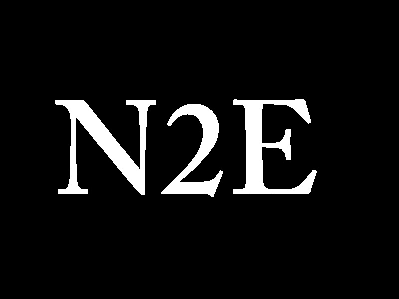

**Project Lifespan\:**2015 - 2016  
 

N2E was a software company that created a real-time cognitive assessment software application embedded in video games, providing recommendations to parents for their child.  Based on cognitive neuroscience and advanced statistical and machine learning methods, N2E designed video games without interfering with the entertainment purpose of the game for children (6-10 years). N2E performs real-time cognitive assessments while the children are playing the video games and provides recommendations to parents about their child’s cognitive development and appropriate educational programs to improve on specific areas. I developed the video and machine learning backend to provide recommendations based on various conditions specified by current and upcoming research on child development. 