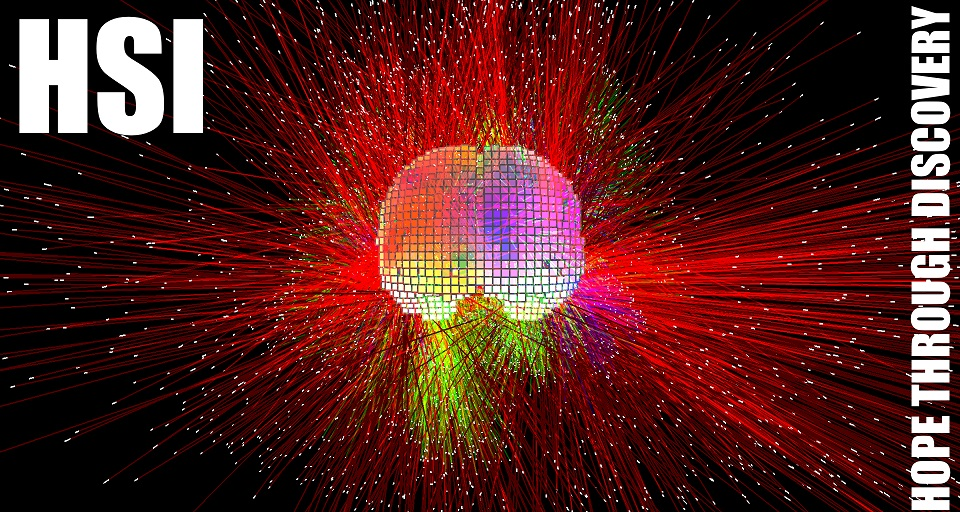

**Project Lifespan\:**2016 - Present  
 

The main goal is to provide practitioners various tools they need to improve the diagnostics, monitoring and treatment of headache related neurogenic and neurodegenerative disorders and diseases.  As the Chief Scientific Officer, I solely created the algorithm for the basis of the tools and discrimination processes of the company. I’ve also attended various conferences as a presenter to showcase our technology to both clinicians and engineers.  This particular algorithm that I have developed is currently patent pending but for more information please refer <a href="http://headachesciences.com/technology.html ">http://headachesciences.com/technology.html </a>