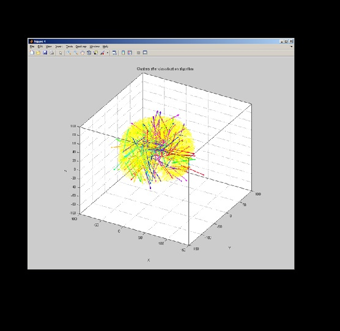

**Project Lifespan\:**2012  
 

I led a group of mathematicians and engineers to find an algorithm to solve a problem often encountered in source localization of MEG and EEG signals, which is the interpretation of electromagnetic fields inferred by these algorithms.  An algorithm was developed to automatically and dynamically identify temporal and spatial clustering within these fields.  Work by Nunez suggest that various electrical fields are associated with cognitive activity.  Therefore, one can identify abnormalities, brain functions and cognitive patterns using source localization of EEG and our new algorithm.  For more information please go to <a href="https://www.fields.utoronto.ca/programs/scientific/11-12/inverseprob/IPSW/problems.html ">https://www.fields.utoronto.ca/programs/scientific/11-12/inverseprob/IPSW/problems.html </a>