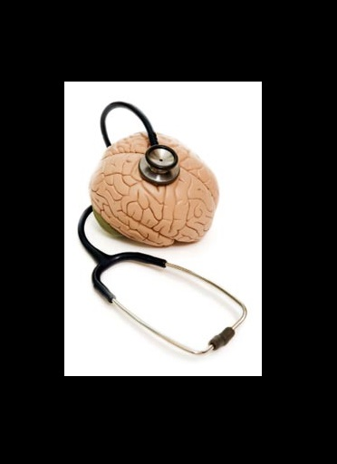

**Project Lifespan\:**2012  
 

The main purpose of the project was to explore the benefits of EEG sonification.  Note that this is not audification which is a direct mapping to the auditory domain, but rather generating a unique mapping system to enhance specific features of EEG to be mapped into the auditory domain.  This was to allow both clinicians and patients to detect abnormalities in their brain activity when listening to their EEG signals.  Though this project’s  primary goal was to develop an EEG system for sleep staging, one can extend the knowledge base into a wide range of applications,   such as measurement of brain states, higher mental function, as well as pain and sensory loss.   The success of the project led to it becoming a module of the proprietary program DECI of “Cerebral Diagnostics Canada Inc” as a real-time auditory display of the electrical brain waves generated in advanced sleep medicine.   It was also used in the Western Hospital Sleep clinic for a sleep recording.  This project also won the innovation award at the International Conference for Up and Coming Engineers 2012.  For more details please refer to <a href="
https://twitter.com/ryersonu/status/245182378153218048"> https://twitter.com/ryersonu/status/245182378153218048 </a> and <a href="http://cerebraldiagnostics.com/Ryerson/RyersonToday.htm"> http://cerebraldiagnostics.com/Ryerson/RyersonToday.htm </a>