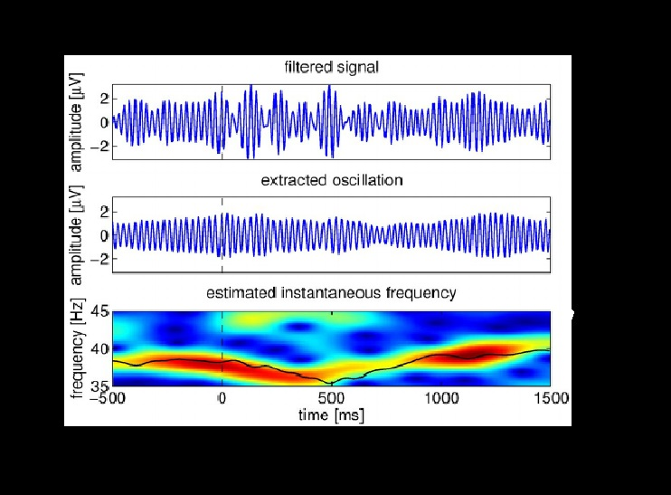

**Project Lifespan\:**2014  
 

EEG is considered to have a very high signal to noise ratio (SNR), and as such we need to develop tools to minimize or remove noise. I implemented and designed many EEG noise reduction techniques as new modules and supporting scripts for the proritetry program of Cerebral Diagnostics Canada Inc. This includes the utilization of the following algorithms: Independent component analysis for eye blink removal, cumulative baseline removal, wavelet decomposition thresholding for muscle artifact rejection, matrix generation for removal of paired electrodes in the EEG source localization algorithm, Empirical Mode Decomposition thresholding for muscle artifact rejection, and notch filtering.