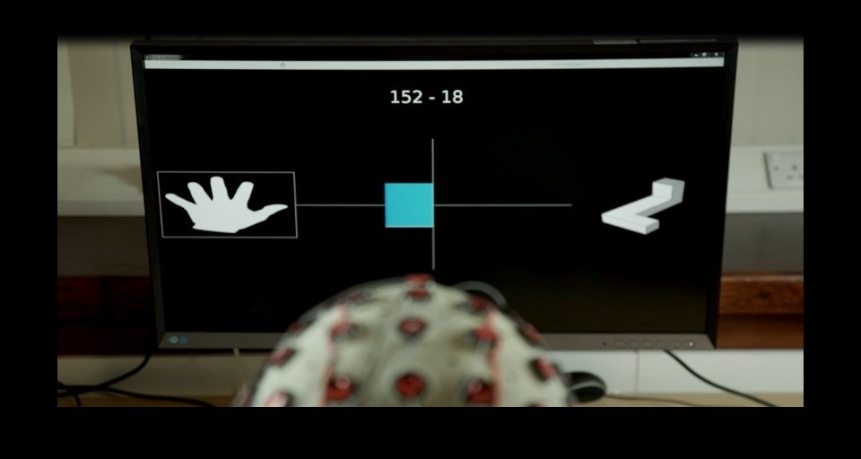

**Project Lifespan\:**2015  
 

An EEG source localization analysis of a 64-channel EEG motor movement and imagery recording consisting of 64 subjects with 14 experimental tasks.  These tasks include the baseline eyes open and eyes closed brain states as well as the typical motor movement and imagery paradigm. Subjects were told to physically move their fists and feet and also imagine them performing those tasks.  Using 3D mean spectral source localization techniques, I identified that left and right brain regions were significantly different in all 14 experimental tasks.  Based on current research, one would suspect event related desynchronization (ERD) to occur, but I did not find this to be the case with our experimental group.  One significant finding from this study was the identification of the brain regions which correspond to the wrist area on the left brain for controlling the right wrist.