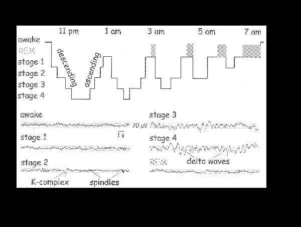

**Project Lifespan\:**2015 - 2018  
 

This is the culmination of a multi year project demonstrating EEG source localization with still images and brain movies can be an innovation in front line clinical sleep medicine.  I took part in the creation of many chapters and appendices dealing with various technical entries associated with signal processing, image analysis, algorithm creation and software development. I also developed new sleep analysis tools and  contributed to current  scientific knowledge in sleep research.  For the book and more details about the  scientific contribution please refer to <a href="https://goo.gl/wNymq7">https://goo.gl/wNymq7 </a> and  <a href="http://theatlasofthegeneratorsofsleep.com/  ">http://theatlasofthegeneratorsofsleep.com/  </a>