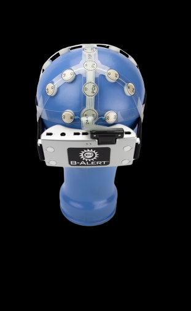

**Project Lifespan\:**2015 - 2017  
 

There is a need to create a portable EEG cap that is safe and affordable and a module to extract EEG signals in a non clinical setting that can be used long term.  Therefore, the goal of this project was to use pre-existing technology to develop a wireless EEG for long term EEG monitoring in the real world setting using WiFi.  With the help of Dr.Ma, I led a team of 4 students to facilitate a prototype of the EEG amplifier and cap.  I was in charge of making sure the design of the cap coincided with the standard 10/20 system and choose appropriate materials for the cap for easy cleaning and storing.  I was also in charge of making sure the amplifier designed matched with the standard sampling rate, noise reduction, amplification and impedance tolerance.   The novel approach was to develop a compressed sensing based sampling rate such that the incoming signal can be as small as possible and that can also simultaneously reduce noise and extract meaningful information.