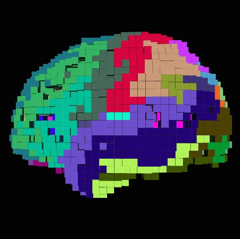

**Project Lifespan\:**2015 - Present  
 

The  primary goal of this project was to develop a pipeline through which a patient can be diagnosed with Alzheimer's.  I contributed in the creation of the experimental protocol including screening and recording software by applying past protocols of various experiments found in the literature.   I also applied for IRB ethics approval as well as HIPPA and PHIPA compliant server end encryption for patient data distribution to collaborators.  Furthermore, I solely created an algorithm which extracted temporal and spatial features of a patient’s EEG and performed classification using a neural network and linear support vector machine. The novelty of this work came about through the use of EEG source localization as a basis of obtaining temporal, spatial and frequency information, along with a myriad of brain network analysis, to try and explain the underlying mechanisms of the Alzheimer's brain state.  For more information please refer to <a href="http://dementiahealth.ca/ ">http://dementiahealth.ca/  </a>