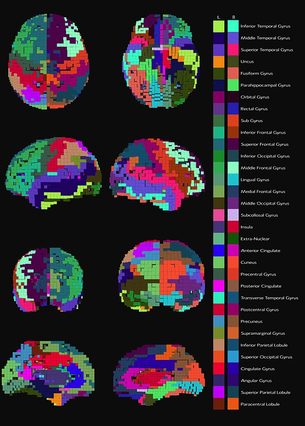

**Project Lifespan\:**2014  
 

Using the source localization brain atlas algorithm I developed an educational brain map of the anatomical locations of the brain as it pertains to a voxelized version of the cortex.  The anatomical regions consisted of Brodmann areas, and the minor and major anatomies of the brain.  Each voxel of the brain was associated with a 0.5 cubic millimeter of the cortex of the brain.  A new color mapping algorithm was developed to segment the brain such that no two brain regions have the same or very similar colour scheme.  This was achieved by adding a constraint function to maximize the distance of two adjacent brain region colours in the colour space.  <a href = "http://portraitofyourmind.com/pages/education/ ">http://portraitofyourmind.com/pages/education/ </a>