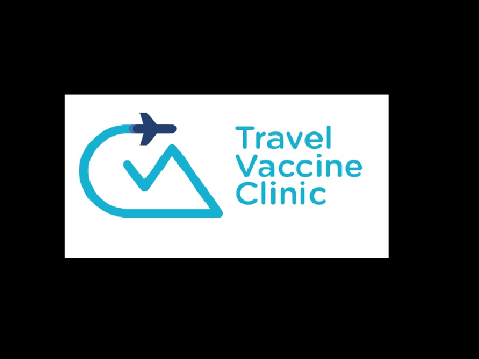

**Project Lifespan\:**2014  
 

Optimized the extraction of information  from the patient forms of a travel clinic.  Employees had to do manual data entry of a filled out patient form into the database which was very time consuming.  I developed a form in which patients can digitally and securely fill out their information.  Once completed, information is sent to a database and can easily be data mined and exported or merged to other databases.