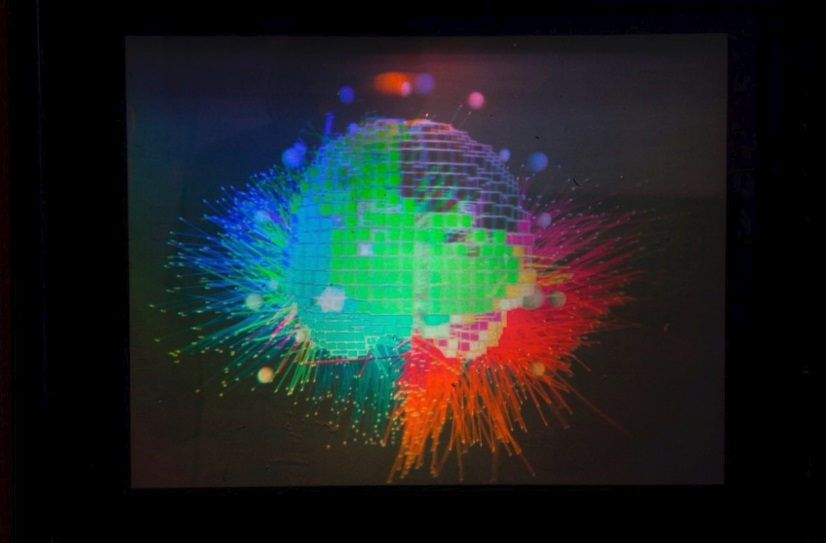

**Project Lifespan\:**2015  
 

The main purpose of the project was to utilize digital holography to enhance spatial features of the cortex which is often limited to 2D imagery. I led the scientific and research team and we developed and identified a workflow to merge the two technologies together in a seamless and coherent manner, while minimizing the change in workflow of each imaging modality. This involved developing a unique predistortion 3D transformation from a biomedical time series signal into artificial holographic projection data.  We were successful in accurately translating source localized EEG signals into two distinct holographic processes (STM Holographic technology and PHASE Research Group technology). For more details please refer to <a href = "https://www2.ocadu.ca/research/phaselab/project/responsive-brain-holograms ">https://www2.ocadu.ca/research/phaselab/project/responsive-brain-holograms </a>