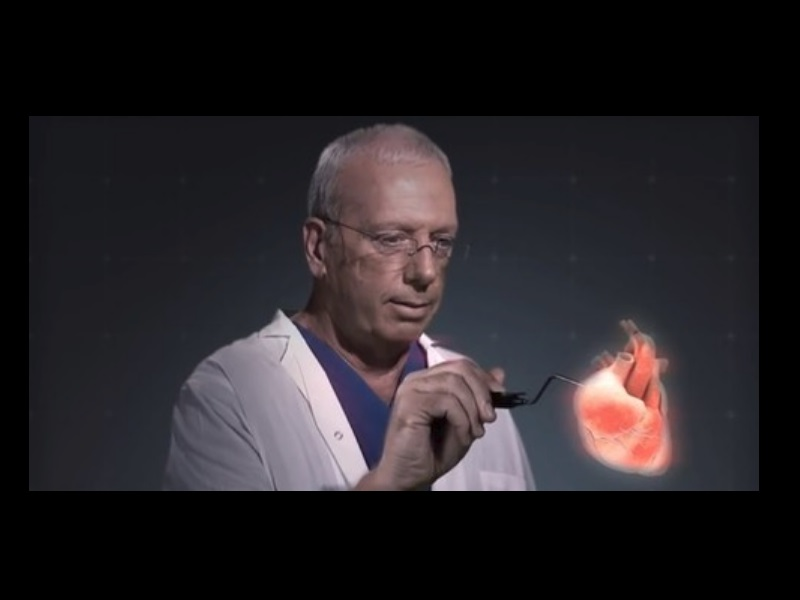

**Project Lifespan\:**2016 - Present  
 

A multiphase research project in which we extend work achieved in 2015 of Responsive Brain Holograms project into a broad range of medical applications.  Currently in the first phase of the project, we are trying to identify various techniques of accomplishing this task.  A point cloud to mesh to geometry seems promising but redundancy of geometry recreation is not ideal due to time constraints. I am currently trying to develop a modified camera model to be applied in the image domain in which a given pixel is then transformed into a hogol (holographic pixel).